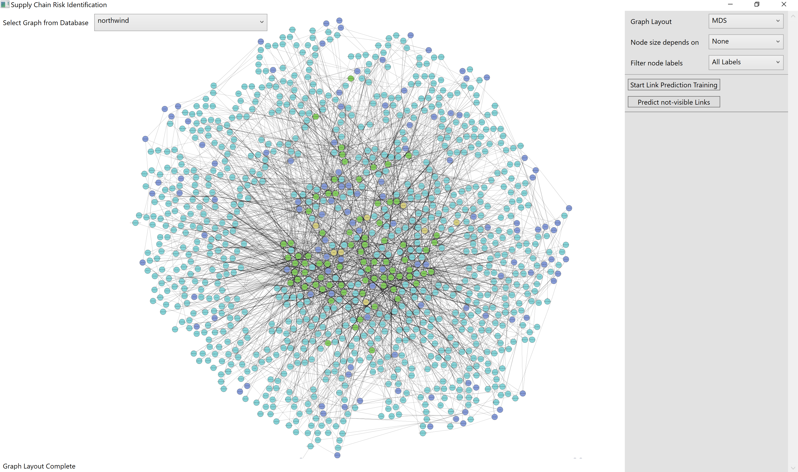

# Supply-Chain-Risk-Identification
###Eine auf Graph Mining basierende Open-Source-Applikation zur Risikoidentifizierung von Supply Chains
Die Windows-Desktopanwendung verbindet sich mit einer Neo4j-Instanz, um auf Graphdaten von Liefernetzwerken zuzugreifen.
Die Anwendung visualisiert den geladenen Graphen mittels Microsoft Automatic Graph Layout.
Dazu sind eine Reihe an Graph-Layouts auswählbar. Außerdem kann die Visualisierung auf einen Knotentypen reduziert werden.

Analytische Fähigkeiten werden eingebunden durch:
* Zentralitätsanalyse (Berechnung der Degree Centrality, Closeness Centrality und Betweenness Centrality)
* Link Prediction (Vorgehen ist von der Supply-Network-Link-Predictor-Methode nach Brintrup et al. abgeleitet [[1]](https://www.ifm.eng.cam.ac.uk/research/manufacturing-analytics/current-projects/supply-chain-link-prediction/)).
---

___
### Vorbereitung
Benötigt wird eine (lokal oder remote) erreichbare Neo4j-Instanz.
* Getestet wurde mit einem lokalen Instanz von Neo4j Desktop 1.4.8
* Das Plugin Graph Data Science Library muss installiert sein. (Getestet mit Version 1.7.0)
* Unter einem erstellten und laufenden DBMS lassen sich Datenbanken hinzufügen.
* Es empfiehlt sich, eine Datenbank pro Netzwerk zu verwenden.
* Mögliche Testdatenbanken:
  * Northwind-Beispieldatenbank - Mittels Neo4j Browser zu laden:
    >:play northwind graph
  * Supply Network einer Honda Accord Mittelkonsole nach [Choi & Hong (2002)](https://asu.pure.elsevier.com/en/publications/unveiling-the-structure-of-supply-networks-case-studies-in-honda-). Cypher-Anweisungen sind unter SCRI/Database/Database Creation Queries zu finden.
  * Mehrstufige Supply Chain in der Maschinenbaubranche nach [Willems (2007)](http://citeseerx.ist.psu.edu/viewdoc/download?doi=10.1.1.670.481&rep=rep1&type=pdf). Ebenfalls unter SCRI/Database/Database Creation Queries zu finden.
### Starten der Anwendung
Über das Fenster zur Verbindung mit dem Datenbanksystem lassen sich Adresse, sowie Benutzername und Passwort eingeben.
Bei erfolgreicher Verbindung öffnet sich das Hauptfenster und der Visalisierung des in Neo4j als Standard eingestellten Graphen.
